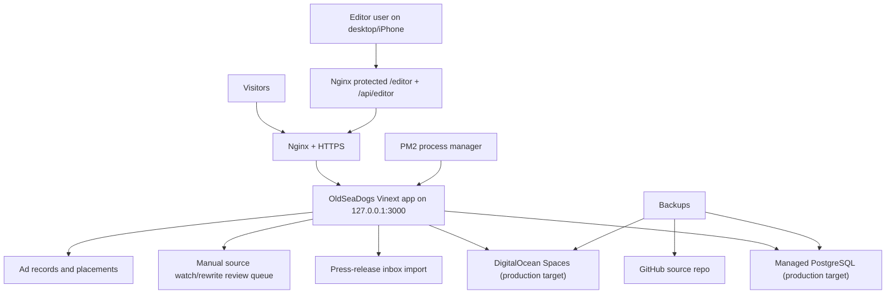

# OldSeaDogs DigitalOcean Deployment Plan

Status: preparation only. Do not switch `oldseadogs.com`, do not change live DNS, and do not treat this as a go-live instruction until staging has been approved.

## Current Architecture Audit

The new OldSeaDogs site is a Vinext/Next-style React application with one app surface:

- Public website: homepage, sections, story pages, search, ports, clubs, legal pages, author/contact pages.
- Private editor: `/editor` plus `/api/editor`.
- Database-backed editor data: stories, media records, adverts, site settings and press-release review items.
- Media uploads: local development writes to `public/uploads`; hosted Sites runtime expects object storage through a `MEDIA` bucket.
- Scraper/rewrite workflow: `content/source-watch.ts` and `lib/source-watch-runner.ts` watch selected boating sources and create review drafts only.
- Email press-release workflow: `lib/press-release-utils.ts` and editor API actions import, review, generate, draft and publish press-release-derived stories.
- Ad management: `db/schema.ts` has an `ads` table and the editor can manage manual/sponsor placements.
- Ports and clubs: migrated as story records, with structured support in `content/club-profiles.ts`, `content/port-map.ts` and `content/venue-details.ts`.

The app now has two production paths:

1. Cloudflare/Sites path: `npm run build` and the existing Worker/Sites runtime with D1/R2 bindings.
2. DigitalOcean Node path: `npm run build:do` and `npm run start:do` on a plain Node 22 server.

Important production note: DigitalOcean will not provide Cloudflare D1/R2 bindings. The Node path can now start without the `cloudflare:` runtime protocol error, but persistent online editor data still needs a DigitalOcean-native storage adapter:

1. Recommended: migrate runtime storage from D1/R2 bindings to DigitalOcean Managed PostgreSQL and Spaces.
2. Temporary staging only: run the DigitalOcean Node server to test pages, editor access and deployment mechanics, while treating database/media persistence as not final.

## Recommended DigitalOcean Setup

Use a Droplet rather than App Platform for the first production build because the editor, uploads, review queue and future background jobs need predictable server control.

Recommended staging:

- Droplet: Basic, London region, Ubuntu 24.04 LTS.
- Size: 2 GB RAM, 1 vCPU, 50 GB SSD.
- Cost estimate: about USD 12/month for the Droplet, plus about USD 2.40/month for weekly Droplet backups.
- Purpose: staging preview, editor security testing, upload testing, sitemap/robots checks.

Recommended production:

- Droplet: Basic, London region, Ubuntu 24.04 LTS.
- Size: 4 GB RAM, 2 vCPU, 80 GB SSD.
- Cost estimate: about USD 24/month for the Droplet.
- Database: DigitalOcean Managed PostgreSQL, Basic 1 GB/1 vCPU to start, about USD 15.15/month.
- Media: DigitalOcean Spaces, about USD 5/month including 250 GiB storage and 1 TiB outbound transfer.
- Droplet backups: about 20% of Droplet cost for weekly backups.
- Estimated production total before taxes/extra traffic: about USD 49/month.

Why this shape:

- The site has more than a brochure workload: private editor, uploads, content database, review queue, adverts, source checks and press-release tools.
- 4 GB RAM gives Node, builds, PM2, Nginx and occasional scraper/rewrite work room without scraping the barrel.
- PostgreSQL and Spaces keep data and media independent of a single server disk.

Reference pricing checked on 2026-06-16:

- DigitalOcean Droplets: https://www.digitalocean.com/pricing/droplets
- DigitalOcean Managed Databases: https://www.digitalocean.com/pricing/managed-databases
- DigitalOcean Spaces: https://www.digitalocean.com/pricing/spaces-object-storage
- Node.js LTS guidance: https://nodejs.org/en/about/previous-releases

## Production Architecture



## Deployment Preparation Files

This preparation adds:

- `deploy/oldseadogs.env.example`: staging/production environment variable template.
- `ecosystem.config.cjs`: PM2 application config.
- `deploy/nginx/oldseadogs-staging.conf`: staging Nginx reverse proxy template.
- `deploy/nginx/oldseadogs-production.conf`: production Nginx template for later cutover approval.
- `PRODUCTION.md`: operating notes.
- `BACKUP.md`: backup and recovery notes.
- `reports/digitalocean-production-readiness-2026-06-16.md`: current readiness report.

## Server Build Steps

These commands are for a new staging Droplet after approval. They do not touch live DNS unless you create a staging-only DNS record.

Create the staging infrastructure from your own DigitalOcean account. The same actions can be done in the DigitalOcean control panel; these `doctl` commands are the command-line equivalent:

```bash
# One-time local setup for the DigitalOcean CLI.
doctl auth init

# Pick your SSH key id first.
doctl compute ssh-key list

# Create a staging Droplet in London with backups and monitoring.
doctl compute droplet create oldseadogs-staging \
  --region lon1 \
  --image ubuntu-24-04-x64 \
  --size s-1vcpu-2gb \
  --ssh-keys YOUR_SSH_KEY_ID \
  --enable-backups \
  --enable-monitoring \
  --wait

# Create the production-target database for staging tests.
# The app still needs its D1-to-PostgreSQL adapter/migration before this can be live data.
doctl databases create oldseadogs-postgres-staging \
  --engine pg \
  --region lon1 \
  --size db-s-1vcpu-1gb \
  --num-nodes 1

# Create a Spaces bucket for media uploads using an S3-compatible client.
aws --endpoint-url https://lon1.digitaloceanspaces.com \
  s3 mb s3://oldseadogs-media-staging
```

Log in to the new Droplet:

```bash
ssh root@YOUR_STAGING_SERVER_IP
adduser oldseadogs
usermod -aG sudo oldseadogs
ufw allow OpenSSH
ufw allow "Nginx Full"
ufw enable
apt update
apt upgrade -y
apt install -y nginx certbot python3-certbot-nginx git curl build-essential apache2-utils
curl -fsSL https://deb.nodesource.com/setup_22.x | bash -
apt install -y nodejs
npm install -g pm2
```

Node version:

- The project currently declares `node >=22.13.0`.
- Use Node 22 LTS first because it matches the project and is still LTS.
- Test Node 24 LTS separately later before upgrading production.

## App Install Steps

Use GitHub once the repo push is working, or upload the saved archive manually if Git access is still blocked.

```bash
sudo mkdir -p /var/www/oldseadogs /etc/oldseadogs /var/www/letsencrypt
sudo chown -R oldseadogs:oldseadogs /var/www/oldseadogs
su - oldseadogs
cd /var/www/oldseadogs
git clone https://github.com/captainoldseadog-hash/ke-https-github.com-michaelhodges-oldseadogs-new.git app
cd app
npm ci
cp deploy/oldseadogs.env.example /tmp/oldseadogs.env
```

Edit `/tmp/oldseadogs.env`, keep `OLDSEADOGS_ENV=staging` for staging, then install it privately:

```bash
exit
sudo install -m 600 -o oldseadogs -g oldseadogs /tmp/oldseadogs.env /etc/oldseadogs/oldseadogs.env
sudo -iu oldseadogs
cd /var/www/oldseadogs/app
set -a
. /etc/oldseadogs/oldseadogs.env
set +a
npm run check:storage
npm run build:do
pm2 start ecosystem.config.cjs --update-env
pm2 save
pm2 startup systemd -u oldseadogs --hp /home/oldseadogs
```

Run the command printed by `pm2 startup` as root.

## Nginx and SSL Setup

For staging, choose one of these:

- Preferred: `staging.oldseadogs.com` pointing to the Droplet, after approval.
- Alternative: a separate temporary domain you control.
- If no DNS is approved, use the Droplet IP for initial HTTP-only smoke testing and delay SSL.

Create the editor password:

```bash
sudo htpasswd -c /etc/nginx/oldseadogs.htpasswd captain
sudo cp deploy/nginx/oldseadogs-staging.conf /etc/nginx/sites-available/oldseadogs-staging
sudo ln -s /etc/nginx/sites-available/oldseadogs-staging /etc/nginx/sites-enabled/oldseadogs-staging
sudo nginx -t
sudo systemctl reload nginx
```

After the staging DNS record is live:

```bash
sudo certbot --nginx -d staging.oldseadogs.com
sudo nginx -t
sudo systemctl reload nginx
```

The production Nginx file is intentionally separate and must not be enabled until formal go-live.

## Database and Media Migration Work Required

Before production go-live, replace the Cloudflare-specific persistence layer:

- Move story/editor/ad/press-release data from D1-style SQLite schema to PostgreSQL.
- Replace R2 bucket calls with Spaces S3-compatible storage.
- Keep local `public/uploads` only for development and emergency import/export.
- Add one migration script to export current local/D1 editor records and import them to PostgreSQL.

Do not go live on a Droplet with only local file/database storage unless the site is treated as temporary staging.

Database connection details after the managed database is created:

```bash
doctl databases list
doctl databases connection YOUR_DATABASE_CLUSTER_ID --format URI --no-header
```

Put the returned URI into the private server env file as `DATABASE_URL`.

Spaces connection values for the private env file:

```bash
SPACES_ENDPOINT=https://lon1.digitaloceanspaces.com
SPACES_REGION=lon1
SPACES_BUCKET=oldseadogs-media-staging
UPLOADS_PUBLIC_URL=https://oldseadogs-media-staging.lon1.digitaloceanspaces.com
```

Create Spaces access keys in the DigitalOcean control panel and put them into:

```bash
SPACES_ACCESS_KEY_ID=
SPACES_SECRET_ACCESS_KEY=
```

## Background Services

At the moment, source watching and press-release import are deliberately review-first editor workflows, not automatic public publishing jobs.

For staging:

- Run source checks from the editor button.
- Run press-release import from the editor.
- Do not add a cron job until the review queue has been tested on the server.
- Set `OLDSEADOGS_DATA_DIR=/var/www/oldseadogs-data` so the editor can keep staging stories, adverts, media records, press releases and blocked senders in a private server-side file store when the database adapter is not attached.
- Uploaded staging images are stored under `OLDSEADOGS_DATA_DIR/media`, with originals, thumbnails and metadata. Include this folder in server backups.
- Configure live inbox import only with server environment variables: `OLDSEADOGS_INBOX_PROVIDER`, `OLDSEADOGS_INBOX_USER`, `OLDSEADOGS_INBOX_HOST`, `OLDSEADOGS_INBOX_PORT`, `OLDSEADOGS_INBOX_SECURE`, and either `OLDSEADOGS_INBOX_PASSWORD` or `OLDSEADOGS_INBOX_TOKEN`.
- Leave inbox variables blank until the mailbox is ready; paste and `.eml` import remain available in the editor.

If a future scheduler is approved, it should call a private review-only endpoint or local script and must never publish stories directly.

## Cloudflare Deployment Path

Use this only for Sites/Cloudflare-compatible hosting:

```bash
npm run build
npm run start
```

Runtime expectations:

- Cloudflare Worker runtime.
- D1 binding named `DB`.
- R2 binding named `MEDIA`.
- Worker entry in `worker/index.ts`.
- Legacy redirect handling remains in the Worker entry.

## DigitalOcean Deployment Path

Use this for plain Node.js on Ubuntu/DigitalOcean:

```bash
npm run check:storage
npm run build:do
npm run start:do
```

PM2 command:

```bash
pm2 start npm --name oldseadogs -- run start:do
```

Runtime expectations:

- Node 22 LTS.
- No `cloudflare:` imports in the server bundle.
- Nginx reverse proxy to `127.0.0.1:3000`; `start:do` binds to `127.0.0.1` by default.
- `OLDSEADOGS_ENV=staging` on staging.
- `OLDSEADOGS_ENV=production` only after formal go-live approval.
- `OLDSEADOGS_SITE_URL` or `NEXT_PUBLIC_SITE_URL` set to the staging URL while staging.
- Production canonicals are fixed to `https://oldseadogs.com`.
- `OLDSEADOGS_EDITOR_STAGING_SECRET` set on staging if browser access to `/editor` is needed from the Droplet IP or `staging.oldseadogs.com`.

Known DigitalOcean differences until the PostgreSQL/Spaces adapter is complete:

- Public pages use the migrated static story archive plus any staging edits saved in `OLDSEADOGS_DATA_DIR`.
- `/editor` can save stories, adverts, media records, press-release review items and blocked senders to the staging file store when no database is configured.
- `/api/editor/health` reports either database storage or the staging file-store path.
- Image upload writes local files to `public/uploads` and stores media records in the staging file store until the Spaces/database adapter is complete.
- Source watch and email press-release review remain manual approval workflows; nothing publishes automatically.
- The staging file store must be backed up and replaced with the production database before final launch.

## DigitalOcean Staging Editor Login

Normal browsers on DigitalOcean do not send the OpenAI workspace editor headers. For staging only, the app supports a private password gate:

```bash
OLDSEADOGS_EDITOR_STAGING_SECRET=choose-a-long-private-password
OLDSEADOGS_EDITOR_STAGING_HOSTS=161.35.168.184,staging.oldseadogs.com
```

Behaviour:

- `http://161.35.168.184/editor` shows a staging login form when the cookie is missing.
- The correct password sets an HTTP-only `SameSite=Lax` cookie.
- The cookie is marked `Secure` when the request is HTTPS.
- `/api/editor` and `/api/editor/health` remain protected unless the cookie is present.
- Wrong passwords are rejected and return to the login form.
- Keep this staging password private and remove or replace it with stronger production auth before final go-live.

## Rollback

Before cutover:

- The old live website remains untouched, so rollback is simply leaving DNS pointed at the old host.

## Launch Mode And Indexing

The application uses one explicit launch switch:

```bash
OLDSEADOGS_ENV=staging
```

Staging behaviour:

- `robots.txt` disallows all crawlers.
- Public pages emit `noindex,nofollow`.
- Editor and API routes stay private and noindex.
- Canonical URLs may use the staging URL.
- Editor health shows staging mode.

Production behaviour, only after written approval:

```bash
OLDSEADOGS_ENV=production
OLDSEADOGS_GA4_ID=G-88HT8MHR7T
OLDSEADOGS_ENABLE_ADSENSE=false
OLDSEADOGS_ADSENSE_CLIENT=
```

- `robots.txt` allows public crawling.
- Sitemap is `https://oldseadogs.com/sitemap.xml`.
- Canonical, Open Graph, JSON-LD and share URLs use `https://oldseadogs.com`.
- Editor/API/preview routes remain noindex and protected.
- Staging/debug panels must not appear on public pages.

Required production `robots.txt`:

```text
User-agent: *
Allow: /

Sitemap: https://oldseadogs.com/sitemap.xml
```

Before switching DNS, run:

```bash
npm run lint
npm run build:do
npm run check:launch
```

When the server is formally approved for production, build and restart with the
production environment explicitly selected. This is the step that changes public
SEO output from staging `noindex` and IP canonicals to `index,follow` and
`https://oldseadogs.com` canonicals:

```bash
sudo -iu oldseadogs
cd /var/www/oldseadogs/app
git pull --ff-only
set -a
. /etc/oldseadogs/oldseadogs.env
set +a
OLDSEADOGS_ENV=production \
OLDSEADOGS_SITE_URL=https://oldseadogs.com \
NEXT_PUBLIC_SITE_URL=https://oldseadogs.com \
NEXT_PUBLIC_ENABLE_INDEXING=true \
npm run build:do
OLDSEADOGS_ENV=production \
OLDSEADOGS_SITE_URL=https://oldseadogs.com \
NEXT_PUBLIC_SITE_URL=https://oldseadogs.com \
NEXT_PUBLIC_ENABLE_INDEXING=true \
pm2 startOrReload ecosystem.config.cjs --env production --update-env
pm2 save
pm2 status
```

After the restart, verify:

```bash
curl -I https://oldseadogs.com/
curl https://oldseadogs.com/robots.txt
curl https://oldseadogs.com/sitemap.xml | head
```

## Production Nginx And SSL Template

Do not enable this until DNS points at the DigitalOcean server.

```nginx
server {
    listen 80;
    server_name oldseadogs.com www.oldseadogs.com;

    client_max_body_size 25m;

    location / {
        proxy_pass http://127.0.0.1:3000;
        proxy_http_version 1.1;
        proxy_set_header Host $host;
        proxy_set_header X-Forwarded-Host $host;
        proxy_set_header X-Forwarded-Proto $scheme;
        proxy_set_header X-Real-IP $remote_addr;
        proxy_set_header X-Forwarded-For $proxy_add_x_forwarded_for;
        proxy_set_header Upgrade $http_upgrade;
        proxy_set_header Connection "upgrade";
    }
}
```

After DNS cutover, request certificates:

```bash
sudo certbot --nginx -d oldseadogs.com -d www.oldseadogs.com
```

Then add/confirm:

- HTTP to HTTPS redirect.
- `www.oldseadogs.com` to `oldseadogs.com` redirect.
- Gzip/Brotli compression where available.
- Static asset caching for `/_next/static`, `/images`, `/legacy-photos`, and `/ads`.
- `no-store` for `/editor`, `/editor/preview`, `/api/editor`, and private API routes.

## Redirect Plan

Old Hugo-style paths must not become 404s. The app now supports permanent redirects for:

- `/news/:slug/`
- `/racing/:slug/`
- `/boat-reviews/:slug/`
- `/clubs/:slug/`
- `/ports/:slug/`
- `/destinations/:slug/`
- `/boat-shows/:slug/`
- `/gear/:slug/`
- `/masterclass/:slug/`
- `/lifestyle/:slug/`
- exact old `sourceUrl` values stored in the restored archive

The target is the matching new `/stories/:slug` URL. Test sample old URLs before DNS cutover and confirm they return 301/308 to a 200 target.

After future cutover:

1. Keep the old host available for at least 14 days.
2. Keep the previous app release directory on the Droplet.
3. To roll back app code, point the `/var/www/oldseadogs/current` symlink back to the previous release and restart PM2.
4. To roll back content, restore the latest PostgreSQL backup and Spaces media snapshot/version.

## Update Procedure After Launch

```bash
sudo -iu oldseadogs
cd /var/www/oldseadogs/app
git pull --ff-only
set -a
. /etc/oldseadogs/oldseadogs.env
set +a
npm ci
npm run check:storage
npm run build:do
pm2 reload oldseadogs-web --update-env
pm2 status
```

`npm run build:do` removes the old `dist` directory before building. This avoids stale server-action references after editor changes. Do not run story reconciliation or repair until `npm run check:storage` passes on the server.

## Staging Test Checklist

- Homepage loads.
- `/editor` asks for private login and works on desktop.
- `/editor` works on iPhone Safari.
- Image upload succeeds and persists.
- Search works for `Cowes Week`, `Rolex Fastnet`, `Sunseeker` and `Royal Thames Yacht Club`.
- Ports pages show practical information and map links.
- Clubs pages show profile/contact detail where available.
- Source watch creates review drafts only.
- Press-release workflow creates review items only.
- Ad management can add/edit/disable an advert.
- `robots.txt` blocks staging from indexing.
- Sitemap contains only public pages.
- No drafts, editor routes or API review data are public.
- No production DNS changes have been made.

## Go-Live Approval Gate

Do not point `oldseadogs.com` or `www.oldseadogs.com` at DigitalOcean until:

- Staging has passed the checklist above.
- PostgreSQL/Spaces persistence is complete and backed up.
- The old-to-new redirect mapping has been tested.
- Google readiness checks pass.
- The editor login has a strong password and no public bypass.
- A written go-live approval is given.
